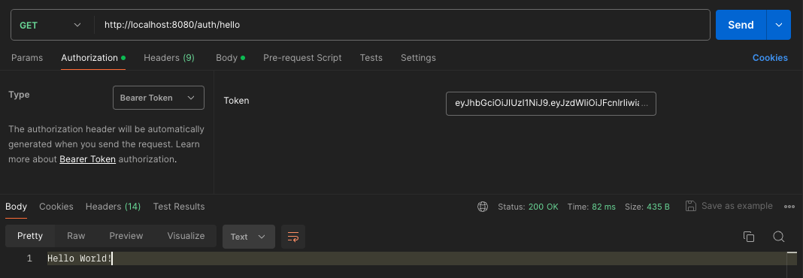

## 1. Register a new user

**URL**: `POST /auth/register` 

`http://localhost:8080/auth/register`
```json
{
"name": "Eryk",
"password": "123456",
"email": "eryk@gmail.com",
"roles": "USER"
}
```


## 2. Token Generation

**Endpoint**: `POST /auth/generateToken`

**Description**: This endpoint is used for existing users to generate a new authentication token.

**Request JSON**:

```json
{
  "username": "Eryk",
  "password": "123456"
}
```


**Response**: A `200 OK` status with a JWT token in the response body.


## 3. Protected Endpoint Access

**Endpoint**: `GET /auth/hello`

**Description**: This endpoint returns a greeting message. It is a protected endpoint that requires a valid token.

**Authentication**: Bearer Token

**Response**: A `200 OK` status with a simple greeting message in the response body.



---
